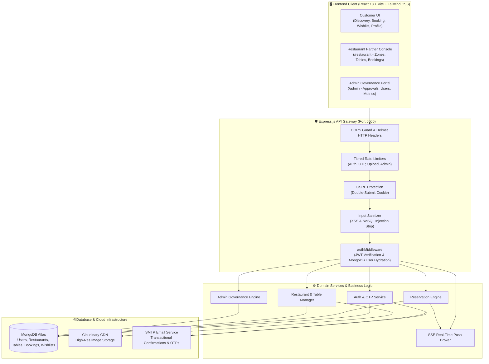
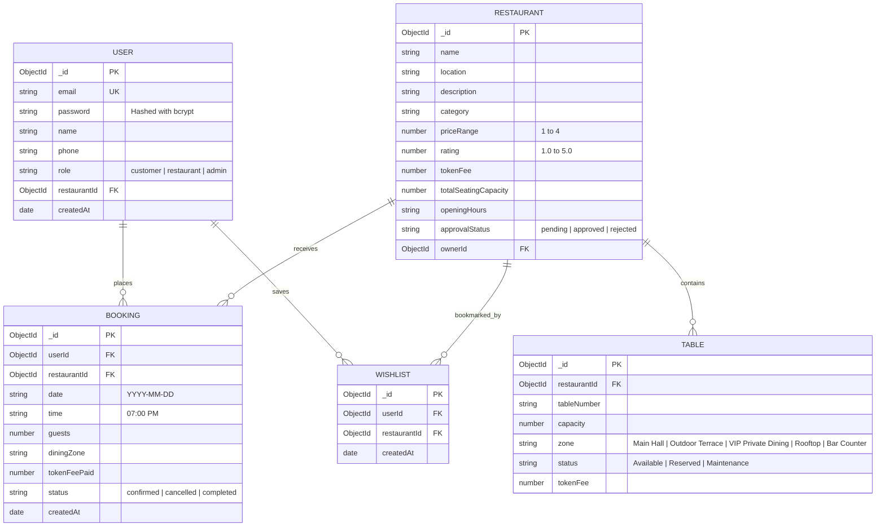

<div align="center">

# 🍽️ BookMyTable

### **Enterprise Full-Stack MERN Restaurant Reservation & Venue Management Platform**

*A modern, high-concurrency reservation engine featuring native JWT authentication, multi-tier Role-Based Access Control (RBAC), dining zone management, real-time Server-Sent Events (SSE), automated transactional emails, and a luxury obsidian-gold UI.*

<br/>

[](https://reactjs.org/)
[](https://vitejs.dev/)
[](https://nodejs.org/)
[](https://expressjs.com/)
[](https://www.mongodb.com/atlas)
[](https://tailwindcss.com/)
[](https://jwt.io/)
[](https://opensource.org/licenses/MIT)

<br/>

**[🌐 Live Demo](https://bookmytable.me)** • **[📖 Documentation](#-table-of-contents)** • **[🚀 Quick Start](#-quick-start)** • **[📡 API Reference](#-api-specification)** • **[🔒 Security Architecture](#-security--resilience)**

</div>

---

## 📌 Executive Summary

**BookMyTable** is a production-grade restaurant discovery, table reservation, and venue management ecosystem designed to eliminate reservation friction for customers, streamline seating logistics for restaurant operators, and provide comprehensive governance tools for platform administrators.

Built strictly on the **MERN (MongoDB, Express, React, Node.js)** stack, the platform prioritizes **data integrity, security, and visual elegance**, adhering to standard software engineering best practices.

### 🌟 Core Value Propositions
- **For Diners**: Instant multi-zone table discovery, real-time availability checks, token deposit protection against no-shows, personal wishlists, and real-time reservation notifications.
- **For Restaurant Operators**: Full control over venue capacity, table layouts by dining zones (VIP, Rooftop, Terrace, Main Hall), booking management with instant status updates, and CSV reporting.
- **For Administrators**: Centralized control panel for vetting and approving restaurant applications, auditing registered user accounts, adjusting roles, and monitoring platform metrics.

---

## 📋 Table of Contents

- [System Architecture](#-system-architecture)
- [Key Features](#-key-features)
- [Role-Based Access Control (RBAC)](#-role-based-access-control-rbac)
- [Technology Stack](#-technology-stack)
- [Project Directory Structure](#-project-directory-structure)
- [Quick Start Guide](#-quick-start-guide)
- [Environment Configuration](#-environment-configuration)
- [Data Models & Schema](#-data-models--schema)
- [API Specification](#-api-specification)
- [Security & Resilience Engineering](#-security--resilience-engineering)
- [Deployment Guidelines](#-deployment-guidelines)
- [Troubleshooting & FAQs](#-troubleshooting--faqs)
- [Contributing & License](#-contributing--license)

---

## 🏗️ System Architecture

The following diagram illustrates the request lifecycle, security barriers, authentication layer, and service distribution across the BookMyTable ecosystem:



---

## ✨ Key Features

### 👤 Customer Experience
- 🔍 **Faceted Search & Filter Engine**: Filter dining spots by cuisine category, location, price level (₹ to ₹₹₹₹), and minimum star rating with debounced live search queries.
- 🪑 **Zone-Specific Seating Reservations**: Choose custom dining atmospheres (*Main Hall, Outdoor Terrace, VIP Private Dining, Rooftop, Bar Counter*) with customized token deposits.
- 💳 **Token Fee Guarantee System**: Per-seat deposit calculation (default ₹150) that secures reservations and reduces no-show rates.
- ❤️ **Real-Time Wishlist Management**: Bookmark venues instantly with optimistic UI updates and live bookmark counts.
- 🔔 **Real-Time SSE Status Stream**: Long-lived Server-Sent Events connection pushing instant reservation approvals, completions, or cancellations directly to the user's browser.
- 📧 **Automated Transactional Emails**: Instant HTML booking confirmation receipts, status alerts, and one-time verification passcodes (OTPs).

### 🏪 Restaurant Partner Operations
- 📊 **Operational Partner Dashboard (`/restaurant`)**: Real-time KPI summaries covering today's bookings, occupancy rates, table turnaround, and revenue generation.
- 📐 **Interactive Table Inventory Manager**: Create, configure, update, and toggle table statuses (`Available`, `Reserved`, `Maintenance`) grouped by seating zone.
- 📋 **Reservation Lifecycle Management**: Review guest requests, confirm bookings, mark dining sessions completed, or process cancellations with automated triggers.
- 📤 **One-Click CSV Export**: Download complete guest sheets and reservation histories formatted for operational review and auditing.
- 🖼️ **Venue Customization & Cloudinary Uploads**: Manage business hours, capacity constraints, description details, and upload high-resolution venue photos directly to Cloudinary CDN.

### 👨‍💼 Platform Administration & Governance
- 🎛️ **Central Command Center (`/admin`)**: Bird's-eye metrics on platform GMV, total active users, registered dining locations, and system throughput.
- 🏢 **Restaurant Verification Pipeline**: Review pending onboarding submissions with one-click **Approve** and **Reject** mechanisms.
- 👥 **User Role Management**: Inspect all registered user accounts with administrative capability to promote customers to `restaurant` partners or demote accounts safely.
- 📑 **Global Booking Oversight**: Search, inspect, and monitor reservations across all partner venues platform-wide.

---

## 👥 Role-Based Access Control (RBAC)

BookMyTable enforces a robust, multi-tier authorization hierarchy:

```
                      ┌──────────────────────────────┐
                      │        Platform Admin        │
                      │           ("admin")          │
                      │  - Platform-wide governance  │
                      │  - Venue approvals/rejections│
                      │  - User promotion/demotion   │
                      └──────────────▲───────────────┘
                                     │
                        Promoted by Admin via /admin
                                     │
                      ┌──────────────┴───────────────┐
                      │      Restaurant Partner      │
                      │        ("restaurant")        │
                      │  - Venue dashboard access    │
                      │  - Table layout & zones      │
                      │  - Guest booking processing  │
                      └──────────────▲───────────────┘
                                     │
                         Default Role on Registration
                                     │
                      ┌──────────────┴───────────────┐
                      │       Standard Customer      │
                      │         ("customer")         │
                      │  - Search, browse & filter   │
                      │  - Table booking flow        │
                      │  - Wishlists & Profile       │
                      └──────────────────────────────┘
```

### Authorization Rules & Logic
1. **Default Registration**: Any user registering via `/api/auth/register` is assigned `role: "customer"` by default.
2. **Super Admin Assignment**: Designated admin accounts configured in the server's `ADMIN_EMAILS` environment variable (e.g. `aaryanpatel9784@gmail.com`) automatically inherit `admin` privileges upon authentication.
3. **Partner Elevation**: Only an authenticated `admin` has the authority to promote a `customer` to `restaurant` (or demote back to `customer`) through the Admin Users panel (`/admin/users`).
4. **Defense in Depth**:
   - Backend routes are protected via [`authMiddleware.js`](file:///d:/Projects/BookMyTable/server/middleware/authMiddleware.js), [`requireAdmin.js`](file:///d:/Projects/BookMyTable/server/middleware/requireAdmin.js), and [`requireRole.js`](file:///d:/Projects/BookMyTable/server/middleware/requireRole.js).
   - Frontend routes are shielded with `<UserProtectedRoute>`, `<RestaurantProtectedRoute>`, and `<AdminProtectedRoute>` route wrappers to prevent unauthorized access or UI flashes.

---

## 🛠️ Technology Stack

### Frontend Application
| Package / Library | Version | Purpose |
|---|:---:|---|
| **React** | `18.2.0` | Declarative UI framework |
| **Vite** | `6.0.0` | High-speed ESM development server & production bundler |
| **Tailwind CSS** | `3.4.1` | Curated luxury obsidian design system |
| **React Router DOM** | `6.22.0` | Client-side routing with guarded route wrappers |
| **Axios** | `1.6.7` | HTTP client with automatic Bearer token & CSRF injection |
| **Lucide React** | `0.344.0` | Vector iconography |
| **React Hot Toast** | `2.4.1` | Lightweight, non-intrusive micro-animations |

### Backend API Server
| Package / Library | Version | Purpose |
|---|:---:|---|
| **Node.js** | `18.x / 20.x` | Asynchronous server runtime |
| **Express.js** | `4.18.2` | RESTful routing and middleware pipeline |
| **Mongoose** | `8.2.0` | Object Data Modeling (ODM) for MongoDB Atlas |
| **JSONWebToken** | `9.0.2` | Stateless signed authentication tokens |
| **BcryptJS** | `2.4.3` | Salted password hashing (10 computation rounds) |
| **Multer** | `1.4.5` | In-memory multipart buffer processing |
| **Cloudinary SDK** | `2.0.1` | Media asset hosting, optimization, and transformation |
| **Nodemailer** | `6.9.9` | SMTP transactional email transport engine |
| **Express Rate Limit** | `7.1.5` | Distributed IP rate limiting algorithms |

---

## 📁 Project Directory Structure

```
BookMyTable/
├── client/                               # Frontend Single Page Application
│   ├── public/                           # Favicons and static web assets
│   ├── src/
│   │   ├── admin/                        # Admin Portal (Role: admin)
│   │   │   ├── components/               # AdminNavbar, AdminSidebar, ConfirmModal
│   │   │   ├── pages/                    # Dashboard, RestaurantsAdmin, UsersAdmin, Add/Edit
│   │   │   ├── services/                 # adminApi.js
│   │   │   └── utils/                    # exportCSV.js
│   │   ├── restaurant/                   # Partner Console (Role: restaurant)
│   │   │   ├── components/               # RestaurantHeader, RestaurantSidebar, TimeSpentModal
│   │   │   ├── pages/                    # RestaurantDashboard, TablesManagement, Bookings, Settings
│   │   │   ├── services/                 # restaurantApi.js
│   │   │   └── utils/                    # exportCSV.js
│   │   ├── components/                   # Shared UI (Navbar, Footer, BookingForm, RestaurantCard)
│   │   ├── context/                      # State Contexts (AuthContext, NotificationContext, WishlistContext)
│   │   ├── hooks/                        # Custom React Hooks (useDebounce)
│   │   ├── pages/                        # Public Pages (Home, Restaurants, Details, Booking, Profile)
│   │   ├── services/                     # Central Axios client (api.js)
│   │   ├── utils/                        # Toast helpers, date formatting, zone calculations
│   │   ├── App.jsx                       # Route layout and route guards
│   │   ├── index.css                     # Global design tokens and obsidian theme
│   │   └── main.jsx                      # React DOM root entrypoint
│   ├── .env.example                      # Frontend environment template
│   ├── .gitignore                        # Frontend Git ignore rules
│   ├── package.json                      # Frontend dependencies and build scripts
│   ├── tailwind.config.js                # Tailwind styling extensions
│   └── vite.config.js                    # Vite bundler and dev server configuration
│
├── server/                               # Backend REST API Application
│   ├── config/                           # Database and caching connections (db.js, redis.js)
│   ├── controllers/                      # Route business logic handlers
│   │   ├── adminController.js            # Admin analytics, approvals, and user management
│   │   ├── authController.js             # Native signup, login, OTP verification, password reset
│   │   ├── bookingController.js          # Table bookings, cancellations, and status management
│   │   ├── restaurantController.js       # Restaurant searching, detail retrieval, and reviews
│   │   ├── restaurantDashboardController.js # Partner table inventory and booking processing
│   │   ├── uploadController.js           # Cloudinary media uploads
│   │   ├── userController.js             # User profiles and password changes
│   │   └── wishlistController.js         # Wishlist bookmarking operations
│   ├── middleware/                       # Request processing middleware
│   │   ├── asyncHandler.js               # Async exception forwarding
│   │   ├── authMiddleware.js             # Native JWT authentication and Mongo user hydration
│   │   ├── csrfProtection.js             # Double-Submit Cookie CSRF defense
│   │   ├── errorHandler.js               # Global error handler with formatted JSON responses
│   │   ├── inputSanitizer.js             # Input sanitization against XSS and NoSQL injection
│   │   ├── passwordValidator.js          # Password complexity enforcement
│   │   ├── rateLimiter.js                # Rate limiters (Auth, OTP, API, Upload)
│   │   ├── requireAdmin.js               # Admin authorization assertion
│   │   ├── requireRole.js                # Multi-role access control
│   │   └── uploadImage.js                # Multer memory storage and file type validation
│   ├── models/                           # Mongoose data schemas (User, Restaurant, Table, Booking, Wishlist)
│   ├── routes/                           # Modular Express route declarations
│   ├── services/                         # External services (otpService.js)
│   ├── utils/                            # Core utilities (emailService, AppError, logger, sseManager)
│   ├── app.js                            # Express application setup and middleware pipeline
│   ├── server.js                         # Server listener and startup diagnostics
│   ├── .env.example                      # Backend environment template
│   ├── .gitignore                        # Backend Git ignore rules
│   └── package.json                      # Backend dependencies and scripts
│
├── .gitignore                            # Enterprise repository Git ignore rules
└── README.md                             # Comprehensive project documentation
```

---

## 🚀 Quick Start Guide

### Prerequisites
Make sure you have the following installed on your machine:
- **Node.js**: `v18.0.0` or higher
- **npm**: `v9.0.0` or higher
- A **MongoDB Atlas** cluster connection string (or local MongoDB daemon)

### 1. Clone the Repository
```bash
git clone https://github.com/Aaryan-9784/BookMyTable.git
cd BookMyTable
```

### 2. Install Dependencies
```bash
# Install Server dependencies
cd server
npm install

# Install Client dependencies
cd ../client
npm install
```

### 3. Setup Environment Variables
Copy `.env.example` to `.env` in both folders:

**On Windows (PowerShell):**
```powershell
Copy-Item server\.env.example server\.env
Copy-Item client\.env.example client\.env
```

**On macOS / Linux (Bash):**
```bash
cp server/.env.example server/.env
cp client/.env.example client/.env
```

*(Configure your `MONGODB_URI`, `JWT_SECRET`, and email credentials as detailed below).*

### 4. Run Development Servers
Open two terminal windows:

```bash
# Terminal 1: Backend Server (http://localhost:5000)
cd server
npm run dev
```

```bash
# Terminal 2: Frontend Client (http://localhost:5173)
cd client
npm run dev
```

Navigate to **`http://localhost:5173`** in your browser.

---

## 🔐 Environment Configuration

### Backend Environment (`server/.env`)

```env
# Server Runtime
PORT=5000
NODE_ENV=development
CLIENT_URL=http://localhost:5173

# Database Connection (MongoDB Atlas)
MONGODB_URI=mongodb+srv://<username>:<password>@cluster0.xxxxx.mongodb.net/bookmytable?retryWrites=true&w=majority

# Native JWT Authentication
JWT_SECRET=your-secure-random-64-character-hex-string
JWT_EXPIRES_IN=7d

# Role-Based Access Control
ADMIN_EMAILS=aaryanpatel9784@gmail.com

# SMTP Email Dispatch (Nodemailer with Gmail App Password)
GMAIL_USER=your-email@gmail.com
GMAIL_APP_PASSWORD=xxxx-xxxx-xxxx-xxxx

# Cloudinary CDN (Image Storage)
CLOUDINARY_CLOUD_NAME=your_cloud_name
CLOUDINARY_API_KEY=your_api_key
CLOUDINARY_API_SECRET=your_api_secret

# Razorpay Payment Gateway (Optional / Staging)
RAZORPAY_KEY_ID=rzp_test_xxxxxxxxxx
RAZORPAY_KEY_SECRET=your_razorpay_secret
```

### Frontend Environment (`client/.env`)

```env
# Backend API Base URL
VITE_API_URL=http://localhost:5000

# Razorpay Public Key (Client Checkout)
VITE_RAZORPAY_KEY_ID=rzp_test_xxxxxxxxxx
```

---

## 🗄️ Data Models & Schema



---

## 📡 API Specification

### Authentication & Session (`/api/auth`)
| Method | Route | Access | Description |
|---|---|:---:|---|
| `POST` | `/api/auth/register` | Public | Register new user account (defaults to `role: "customer"`) |
| `POST` | `/api/auth/login` | Public | Authenticate with email/password; returns JWT |
| `POST` | `/api/auth/send-otp` | Public | Dispatch email OTP code for verification |
| `POST` | `/api/auth/verify-otp` | Public | Verify OTP code validity |
| `POST` | `/api/auth/reset-password` | Public | Set new password using verified OTP |
| `GET` | `/api/auth/me` | Authenticated | Retrieve authenticated user profile |
| `POST` | `/api/auth/logout` | Authenticated | Clear authentication cookies and session |
| `GET` | `/api/auth/csrf-token` | Public | Fetch CSRF protection token |

### Public Restaurant Discovery (`/api/restaurants`)
| Method | Route | Access | Description |
|---|---|:---:|---|
| `GET` | `/api/restaurants` | Public | Query restaurants with filtering (`q`, `category`, `location`, `rating`) |
| `GET` | `/api/restaurants/:id` | Public | Fetch single restaurant details and photos |
| `GET` | `/api/restaurants/:id/tables`| Public | Fetch real-time table availability by zone |
| `POST` | `/api/restaurants/:id/reviews`| Authenticated | Submit guest rating and dining review |

### Customer Reservations & Wishlists
| Method | Route | Access | Description |
|---|---|:---:|---|
| `POST` | `/api/bookings` | Authenticated | Create a table reservation |
| `GET` | `/api/bookings/my` | Authenticated | Fetch reservations for logged-in user |
| `GET` | `/api/bookings/:id` | Authenticated | Fetch single reservation details |
| `PATCH` | `/api/bookings/:id/cancel` | Authenticated | Cancel an active booking |
| `GET` | `/api/wishlist` | Authenticated | List all saved wishlist venues |
| `POST` | `/api/wishlist/toggle/:restaurantId` | Authenticated | Toggle venue in wishlist |
| `GET` | `/api/wishlist/check/:restaurantId` | Authenticated | Check if restaurant is bookmarked |
| `GET` | `/api/notifications/stream` | Authenticated | Long-lived SSE real-time notification connection |

### Restaurant Partner Management (`/api/restaurant-dashboard`)
| Method | Route | Access | Description |
|---|---|:---:|---|
| `GET` | `/api/restaurant-dashboard/stats` | Partner / Admin | KPI dashboard metrics and occupancy |
| `GET` | `/api/restaurant-dashboard/tables` | Partner / Admin | List all tables grouped by zone |
| `POST` | `/api/restaurant-dashboard/tables` | Partner / Admin | Add table seating inventory |
| `PUT` | `/api/restaurant-dashboard/tables/:id` | Partner / Admin | Update table capacity, zone, or status |
| `DELETE`| `/api/restaurant-dashboard/tables/:id` | Partner / Admin | Remove table from inventory |
| `GET` | `/api/restaurant-dashboard/bookings` | Partner / Admin | View venue guest booking list |
| `PUT` | `/api/restaurant-dashboard/bookings/:id/status`| Partner / Admin | Update booking state (`confirmed`, `cancelled`, `completed`) |
| `GET` | `/api/restaurant-dashboard/settings` | Partner / Admin | Fetch venue configuration and hours |
| `PUT` | `/api/restaurant-dashboard/settings` | Partner / Admin | Update venue profile, fees, and photo gallery |

### Platform Administration (`/api/admin`)
| Method | Route | Access | Description |
|---|---|:---:|---|
| `GET` | `/api/admin/dashboard/stats` | Admin Only | Platform-wide volume, GMV, and analytics |
| `GET` | `/api/admin/restaurants` | Admin Only | List all venues including pending approvals |
| `POST` | `/api/admin/restaurants` | Admin Only | Create verified restaurant directly |
| `PUT` | `/api/admin/restaurants/:id/approve` | Admin Only | Approve pending restaurant application |
| `PUT` | `/api/admin/restaurants/:id/reject` | Admin Only | Reject pending restaurant application |
| `DELETE`| `/api/admin/restaurants/:id` | Admin Only | Permanently remove venue listing |
| `GET` | `/api/admin/users` | Admin Only | Audit registered user accounts |
| `PUT` | `/api/admin/users/:id/role` | Admin Only | Promote / demote user role (`customer` ↔ `restaurant`) |
| `DELETE`| `/api/admin/users/:id` | Admin Only | Delete user account |

### Media Upload (`/api/upload`)
| Method | Route | Access | Description |
|---|---|:---:|---|
| `POST` | `/api/upload` | Partner / Admin | Upload single image to Cloudinary (multipart/form-data, max 5MB) |

---

## 🔒 Security & Resilience Engineering

1. **CSRF Defense (Double-Submit Cookie)**:
   - State-changing HTTP methods (`POST`, `PUT`, `PATCH`, `DELETE`) require a valid CSRF token in request headers.
2. **Tiered Rate Limiting**:
   - `authLimiter`: 10 requests / 15 mins (Mitigates credential stuffing).
   - `otpLimiter`: 5 attempts / 15 mins (Prevents OTP brute force).
   - `uploadLimiter`: 20 requests / hour (Prevents image storage abuse).
   - `adminLimiter`: 100 requests / 15 mins.
3. **Input Sanitization (XSS / Injection Defense)**:
   - Middleware automatically strips malicious script tags and neutralizes NoSQL operator injection across all payloads.
4. **Password Policy & Cryptography**:
   - Enforces a minimum of 8 characters with lowercase, uppercase, numeric, and special character requirements.
   - Passwords hashed with Bcrypt (10 salt rounds).
5. **Resilient In-Memory Caching Fallback**:
   - In development, the system detects if Redis is absent and falls back to an in-memory cache without connection retry spam.

---

## 🚢 Deployment Guidelines

### Frontend Deployment (Vercel / Netlify)
1. Link your GitHub repository.
2. Configure Root Directory: `client`
3. Build Command: `npm run build`
4. Output Directory: `dist`
5. Set Environment Variable: `VITE_API_URL=https://your-backend-api.com`

### Backend Deployment (Render / Railway / AWS / VPS)
1. Configure Root Directory: `server`
2. Start Command: `node server.js`
3. Add Environment Variables from `server/.env.example`.
4. Whitelist the deployment server's IP address in **MongoDB Atlas Network Access** (`0.0.0.0/0` for cloud providers).

---

## 🐛 Troubleshooting & FAQs

<details>
<summary><b>1. MongoDB Authentication Failed (bad auth : authentication failed)</b></summary>

- Check that the username and password in `MONGODB_URI` match the database user in MongoDB Atlas.
- If your password contains special characters, ensure they are URL-encoded.
- Go to **cloud.mongodb.com** → **Security** → **Database Access** → verify the username or click "Edit" to reset the password.
</details>

<details>
<summary><b>2. CSRF Validation Error</b></summary>

- Verify that `CLIENT_URL` in `server/.env` exactly matches the URL of your frontend application (e.g. `http://localhost:5173`).
</details>

<details>
<summary><b>3. Email OTP Not Received</b></summary>

- Confirm `GMAIL_USER` and `GMAIL_APP_PASSWORD` are correctly configured.
- Note that standard Gmail account passwords cannot be used for SMTP; you must generate a 16-character **App Password** via your Google Account Security settings.
</details>

---

## 📄 Contributing & License

Contributions are welcome! Please follow standard GitHub flow:

1. Fork the Project repository
2. Create your Feature Branch (`git checkout -b feature/NewFeature`)
3. Commit your Changes (`git commit -m 'Add NewFeature'`)
4. Push to the Branch (`git push origin feature/NewFeature`)
5. Open a Pull Request

This project is licensed under the **MIT License**.

<div align="center">

Crafted with ❤️ by the **BookMyTable** Engineering Team

[⬆ Back to Top](#-bookmytable)

</div>
